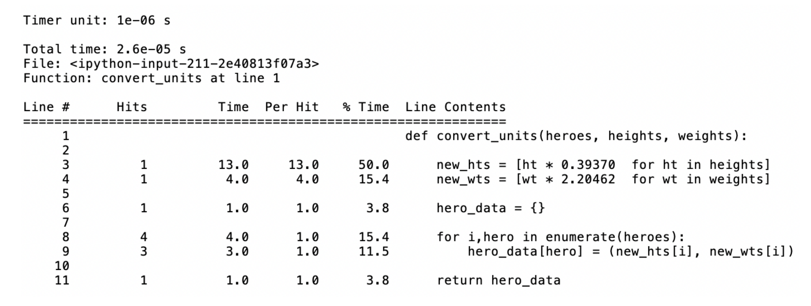
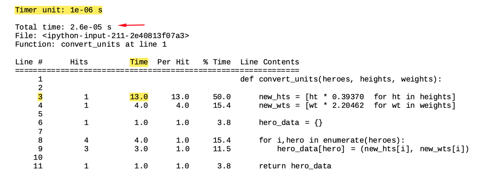
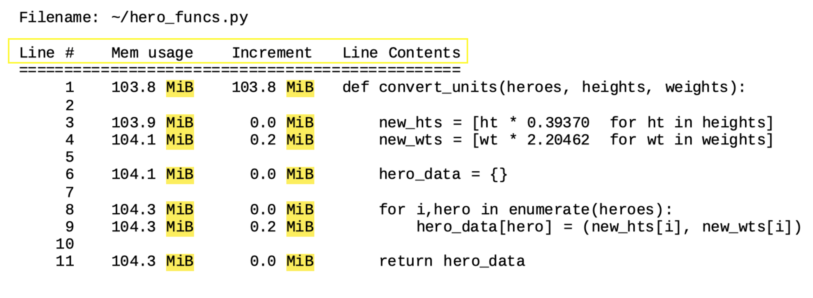
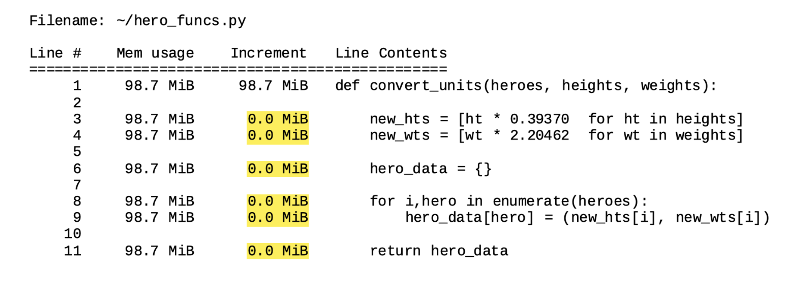

# Examining runtime

## Why should we time our code?
- Allows us to pick the optimal coding approach
- Faster code == more ecient code!

## How can we time our code?
- Calculate runtime with IPython magic command `%timeit`
- **Magic commands:** enhancements on top of normal Python syntax
  - Prexed by the "%" character
  - Link to docs [(here)](https://ipython.readthedocs.io/en/stable/interactive/magics.html)
  - See all available magic commands with `%lsmagic`

## Using %timeit

Code to be timed

```python
import numpy as np
rand_nums = np.random.rand(1000)
```

Timing with `%timeit`

```python
%timeit rand_nums = np.random.rand(1000)

> 8.61 µs ± 69.1 ns per loop (mean ± std. dev. of 7 runs, 100000 loops each)
```

## %timeit output

Code to be timed

```python
rand_nums = np.random.rand(1000)
```

Timming with `%timeit`

```python
%timeit rand_nums = np.random.rand(1000)

> 8.61 µs ± 69.1 ns per loop (mean ± std. dev. of 7 runs, 100000 loops each)
```

|value  |metric  |
|---------|---------|
|8.61     |  mean   |
|69.1     | std.dev.|

**7 runs** by **100000 loops**

## Specifying number of runs/loops
Seing the number of runs ( `-r` ) and/or loops ( `-n` )

```python
# Set number of runs to 2 (-r2)
# Set number of loops to 10 (-n10)
%timeit -r2 -n10 rand_nums = np.random.rand(1000)

> 16.9 µs ± 5.14 µs per loop (mean ± std. dev. of 2 runs, 10 loops each)
```

## Using %timeit in line magic mode
Line magic ( `%timeit` )

```python
# Single line of code
%timeit nums = [x for x in range(10)]

> 914 ns ± 7.33 ns per loop (mean ± std. dev. of 7 runs, 1000000 loops each)
```

## Using %timeit in cell magic mode
Cell magic ( `%%timeit` )

```python
# Multiple lines of code

%%timeit

nums = []
for x in range(10):
    nums.append(x)

> 1.17 µs ± 3.26 ns per loop (mean ± std. dev. of 7 runs, 1000000 loops each)
```

## Saving output
Saving the output to a variable ( `-o` )

```python
times = %timeit -o rand_nums = np.random.rand(1000)
> 8.69 µs ± 91.4 ns per loop (mean ± std. dev. of 7 runs, 100000 loops each)
```

```python
times.timings
> [8.697893059998023e-06,
8.651204760008113e-06,
8.634270530001232e-06,
8.66847825998775e-06,
8.619398139999247e-06,
8.902550710008654e-06,
8.633500570012985e-06]
```


```python
times.best
> 8.619398139999247e-06
```


```python
times.worst
> 8.902550710008654e-06
```

## Comparing times
Python data structures can be created using formal name

```python
formal_list = list()
formal_dict = dict()
formal_tuple = tuple()
```

Python data structures can be created using literal syntax

```python
literal_list = []
literal_dict = {}
literal_tuple = ()
```


```python
f_time = %timeit -o formal_dict = dict()

> 145 ns ± 1.5 ns per loop (mean ± std. dev. of 7 runs, 10000000 loops each)
```


```python
l_time = %timeit -o literal_dict = {}

> 93.3 ns ± 1.88 ns per loop (mean ± std. dev. of 7 runs, 10000000 loops each)
```


```python
diff = (f_time.average - l_time.average) * (10**9)

print('l_time better than f_time by {} ns'.format(diff))

> l_time better than f_time by 51.90819192857814 ns
```

```python
%timeit formal_dict = dict()
> 145 ns ± 1.5 ns per loop (mean ± std. dev. of 7 runs, 10000000 loops each)

%timeit literal_dict = {}
> 93.3 ns ± 1.88 ns per loop (mean ± std. dev. of 7 runs, 10000000 loops each)
```

# Code profiling for runtime

## Code profiling
- Detailed stats on frequency and duration of function calls
- Line-by-line analyses
- Package used: `line_profiler`

```python
pip install line_profiler
```

## Code profiling: runtime

```python
heroes = ['Batman','Superman','Wonder Woman']
hts = np.array([188.0, 191.0, 183.0])
wts = np.array([ 95.0, 101.0, 74.0])
```


```python
def convert_units(heroes, heights, weights):
    new_hts = [ht * 0.39370 for ht in heights]
    new_wts = [wt * 2.20462 for wt in weights]
    
    hero_data = {}
    
    for i,hero in enumerate(heroes):
        hero_data[hero] = (new_hts[i], new_wts[i])
    
    return hero_data
```


```python
convert_units(heroes, hts, wts)

> {'Batman': (74.0156, 209.4389),
'Superman': (75.1967, 222.6666),
'Wonder Woman': (72.0471, 163.1419)}
```

Runtime
```python
%timeit convert_units(heroes, hts, wts)
> 3 µs ± 32 ns per loop (mean ± std. dev. of 7 runs, 100000 loops each)

%timeit new_hts = [ht * 0.39370 for ht in hts]
> 1.09 µs ± 11 ns per loop (mean ± std. dev. of 7 runs, 1000000 loops each)

%timeit new_wts = [wt * 2.20462 for wt in wts]
> 1.08 µs ± 6.42 ns per loop (mean ± std. dev. of 7 runs, 1000000 loops each)
```

```python
%%timeit
hero_data = {}
for i,hero in enumerate(heroes):
    hero_data[hero] = (new_hts[i], new_wts[i])

> 634 ns ± 9.29 ns per loop (mean ± std. dev. of 7 runs, 1000000 loops each)
```

## Code profiling: line_profiler
Using `line_profiler` package

```python
%load_ext line_profiler
```
Magic command for line-by-line times
```python
%lprun -f
```

Using `line_profiler` package
```python
%load_ext line_profiler
```
Magic command for line-by-line times
```python
%lprun -f convert_units
```

Using `line_profiler` package
```
python %load_ext line_profiler
```
Magic command for line-by-line times
```python
%lprun -f convert_units convert_units(heroes, hts, wts)
```

## %lprun output
```python
%lprun -f convert_units convert_units(heroes, hts, wts)
```





VS 


```python
%timeit convert_units convert_units(heroes, hts, wts)

> 3 µs ± 32 ns per loop (mean ± std. dev. of 7 runs, 100000 loops each)
```


# Code profiling for memory usage

Quick and dirty approach

```python
import sys
nums_list = [*range(1000)]
sys.getsizeof(nums_list)
> 9112
```


```python
import numpy as np
nums_np = np.array(range(1000))
sys.getsizeof(nums_np)
> 8096
```

## Code profiling: memory
- Detailed stats on memory consumption
- Line-by-line analyses
- Package used: memory_profiler

```python
pip install memory_profiler
```

Using `memory_profiler` package

```python
%load_ext memory_profiler

%mprun -f convert_units convert_units(heroes, hts, wts)
```

- Functions must be imported when using memory_profiler
  - `hero_funcs.py`

```python
from hero_funcs import convert_units

%load_ext memory_profiler

%mprun -f convert_units convert_units(heroes, hts, wts)
```

## %mprun output
```python
%mprun -f convert_units convert_units(heroes, hts, wts)
```



## %mprun output caveats
Data used in this example is a random sample of **35,000** heroes.
**(not original 480 superheroes dataset)**
```python
%mprun -f convert_units convert_units(heroes, hts, wts)
```


- Inspects memory by querying the operating system
- Results may dier between platforms and runs
  - Can still observe how each line of code compares to others **based on memory consumption**