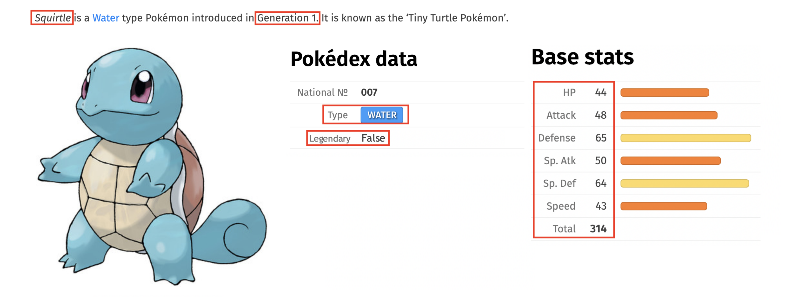
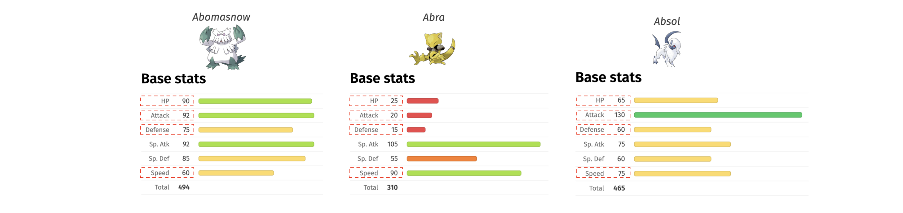

# Efficiently combining, counting, and iterating

## Pokémon Overview
- Trainers (collect Pokémon)
- Pokémon (fictional animal characters)
- Pokédex (stores captured Pokémon)

### Pokémon Description


## Combining objects

```python
names = ['Bulbasaur','Charmander','Squirtle']
hps = [45, 39, 44]
```
```python
combined = []

for i,pokemon in enumerate(names):
    combined.append((pokemon, hps[i]))

print(combined)

> [('Bulbasaur', 45), ('Charmander', 39), ('Squirtle', 44)]
```

## Combining objects with **zip**

```python
names = ['Bulbasaur','Charmander','Squirtle']
hps = [45, 39, 44]
```

```python
combined_zip = zip(names, hps)

print(type(combined_zip))

<class 'zip'>
```

```python
combined_zip_list = [*combined_zip]

print(combined_zip_list)

> [('Bulbasaur', 45), ('Charmander', 39), ('Squirtle', 44)]
```

## The collections module
- Part of Python's Standard Library (built-in module)
- Specialized container datatypes
  - Alternatives to general purpose dict, list, set, and tuple
- Notable:
  - `namedtuple` : tuple subclasses with named elds
  - `deque` : list-like container with fast appends and pops
  - **`Counter` : dict for counting hashable objects**  <--------
  - `OrderedDict` : dict that retains order of entries
  - `defaultdict` : dict that calls a factory function to supply missing values

### Counting with loop

```python
# Each Pokémon's type (720 total)

poke_types = ['Grass','Dark','Fire','Fire', ...]
type_counts = {}

for poke_type in poke_types:
    if poke_type not in type_counts:
        type_counts[poke_type] = 1
    else:
        type_counts[poke_type] += 1

print(type_counts)

> {'Rock': 41,'Dragon': 25,'Ghost': 20,'Ice': 23,'Poison': 28,'Grass': 64,'Flying': 2,'Electric': 40,'Fairy': 17,'Steel': 21,'Psychic': 46,'Bug': 65,'Dark': 28,'Fighting': 25,'Ground': 30,'Fire': 48,'Normal': 92,'Water': 105}
```

### **collections.Counter()**

```python
# Each Pokémon's type (720 total)
poke_types = ['Grass','Dark','Fire','Fire', ...]

from collections import Counter
type_counts = Counter(poke_types)

print(type_counts)

> Counter({'Water': 105,'Normal': 92,'Bug': 65,'Grass': 64,'Fire': 48,
'Psychic': 46,'Rock': 41,'Electric': 40,'Ground': 30,'Poison': 28,
'Dark': 28,'Dragon': 25,'Fighting': 25,'Ice': 23,'Steel': 21,'Ghost': 20,
'Fairy': 17,'Flying': 2})
```


## The itertools module
- Part of Python's Standard Library (built-in module)
- Functional tools for creating and using iterators
- Notable:
  - Innite iterators: `count` , `cycle` , `repeat`
  - Finite iterators: `accumulate` , `chain` , `zip_longest` , etc.
  - **Combination generators: `product` , `permutations` , `combinations`** <---------


### Combinations with loop

```python
poke_types = ['Bug','Fire','Ghost','Grass','Water']
combos = []

for x in poke_types:
    for y in poke_types:
        if x == y:
            continue
        if ((x,y) not in combos) & ((y,x) not in combos):
            combos.append((x,y))

print(combos)

> [('Bug','Fire'), ('Bug','Ghost'), ('Bug','Grass'), ('Bug','Water'),('Fire','Ghost'), ('Fire','Grass'), ('Fire','Water'),('Ghost','Grass'), ('Ghost','Water'), ('Grass','Water')]
```

### **itertools.combinations()**
```python
poke_types = ['Bug','Fire','Ghost','Grass','Water']

from itertools import combinations

combos_obj = combinations(poke_types, 2)

print(type(combos_obj))

> <class 'itertools.combinations'>
```

```python
combos = [*combos_obj]

print(combos)

> [('Bug','Fire'), ('Bug','Ghost'), ('Bug','Grass'), ('Bug','Water'),('Fire','Ghost'), ('Fire',
'Grass'), ('Fire','Water'),('Ghost','Grass'), ('Ghost','Water'), ('Grass','Water')]
```


# Set theory

- Branch of Mathematics applied to collections of objects
  - i.e., `sets`
- Python has built-in `set` datatype with accompanying methods:
  - `intersection()` : all elements that are in both sets
  - `difference()` : all elements in one set but not the other
  - `symmetric_difference()` : all elements in exactly one set
  - `union()` : all elements that are in either set
- Fast membership testing
  - Check if a value exists in a sequence or not
  - Using the `in` operator


## Comparing objects with loops

```python
list_a = ['Bulbasaur','Charmander','Squirtle']
list_b = ['Caterpie','Pidgey','Squirtle']
```


```python
in_common = []

for pokemon_a in list_a:
    for pokemon_b in list_b:
        if pokemon_a == pokemon_b:
            in_common.append(pokemon_a)

print(in_common)

> ['Squirtle']
```

with `set`


```python
list_a = ['Bulbasaur','Charmander','Squirtle']
list_b = ['Caterpie','Pidgey','Squirtle']

set_a = set(list_a)
print(set_a)
> {'Bulbasaur','Charmander','Squirtle'}

set_b = set(list_b)
print(set_b)
> {'Caterpie','Pidgey','Squirtle'}

set_a.intersection(set_b)
> {'Squirtle'}
```

## Efficiency gained with set theory / **intersection** (like inner join)

normal
```python
%%timeit
for pokemon_a in list_a:
    for pokemon_b in list_b:
        if pokemon_a == pokemon_b:
            in_common.append(pokemon_a)

> 601 ns ± 17.1 ns per loop (mean ± std. dev. of 7 runs, 1000000 loops each)
```


more fast!
```python
%timeit in_common = set_a.intersection(set_b)

> 137 ns ± 3.01 ns per loop (mean ± std. dev. of 7 runs, 10000000 loops each)
```

## Set method: **difference**

A minus B
```python
list_a = ['Bulbasaur','Charmander','Squirtle']
list_b = ['Caterpie','Pidgey','Squirtle']

set_a.difference(set_b)

> {'Bulbasaur','Charmander'}
```

B minus A
```python
list_a = ['Bulbasaur','Charmander','Squirtle']
list_b = ['Caterpie','Pidgey','Squirtle']

set_b.difference(set_a)


> {'Caterpie','Pidgey'}
```

## Set method: **symmetric difference**
```python
list_a = ['Bulbasaur','Charmander','Squirtle']
list_b = ['Caterpie','Pidgey','Squirtle']

set_a.symmetric_difference(set_b)

> {'Bulbasaur','Caterpie','Charmander','Pidgey'}
```

## Set method: **union**

```python
list_a = ['Bulbasaur','Charmander','Squirtle']
list_b = ['Caterpie','Pidgey','Squirtle']

set_a.union(set_b)

> {'Bulbasaur','Caterpie','Charmander','Pidgey','Squirtle'}
```

## Membership testing with sets

```python
# The same 720 total Pokémon in each data structure
names_list = ['Abomasnow','Abra','Absol', ...]
names_tuple = ('Abomasnow','Abra','Absol', ...)
names_set = {'Abomasnow','Abra','Absol', ...}

%timeit 'Zubat' in names_list
> 7.63 µs ± 211 ns per loop (mean ± std. dev. of 7 runs, 100000 loops each)

%timeit 'Zubat' in names_tuple
> 7.6 µs ± 394 ns per loop (mean ± std. dev. of 7 runs, 100000 loops each)

%timeit 'Zubat' in names_set
> 37.5 ns ± 1.37 ns per loop (mean ± std. dev. of 7 runs, 10000000 loops each)
```


## Uniques with sets

```python
# 720 Pokémon primary types corresponding to each Pokémon
primary_types = ['Grass','Psychic','Dark','Bug', ...]

unique_types = []

for prim_type in primary_types:
    if prim_type not in unique_types:
        unique_types.append(prim_type)

print(unique_types)

> ['Grass','Psychic','Dark','Bug','Steel','Rock','Normal','Water','Dragon','Electric','Poison','Fire','Fairy','Ice','Ground','Ghost','Fighting','Flying']
```
with sets :
```python
# 720 Pokémon primary types corresponding to each Pokémon
primary_types = ['Grass','Psychic','Dark','Bug', ...]

unique_types_set = set(primary_types)

print(unique_types_set)

> {'Grass','Psychic','Dark','Bug','Steel','Rock','Normal','Water','Dragon','Electric','Poison','Fire','Fairy','Ice','Ground','Ghost','Fighting','Flying'}
```


## Eliminating loops

### Looping in Python
- Looping paerns:
  - `for` loop: iterate over sequence piece-by-piece
  - `while` loop: repeat loop as long as condition is met
  - "nested" loops: use one loop inside another loop
  - Costly!

### Benefits of eliminating loops
- Fewer lines of code
- Beer code readability
  - "Flat is beer than nested"
- Eciency gains

### Eliminating loops with built-ins


```python
# List of HP, Attack, Defense, Speed
poke_stats = [
    [90, 92, 75, 60],
    [25, 20, 15, 90],
    [65, 130, 60, 75],
    ...
]
```


```python
# List of HP, Attack, Defense, Speed
poke_stats = [
    [90, 92, 75, 60],
    [25, 20, 15, 90],
    [65, 130, 60, 75],
    ...
]

# For loop approach
totals = []
for row in poke_stats:
    totals.append(sum(row))

# List comprehension
totals_comp = [sum(row) for row in poke_stats]

# Built-in map() function
totals_map = [*map(sum, poke_stats)]
```


```python
%%timeit
totals = []
for row in poke_stats:
    totals.append(sum(row))
> 140 µs ± 1.94 µs per loop (mean ± std. dev. of 7 runs, 10000 loops each)

%timeit totals_comp = [sum(row) for row in poke_stats]
> 114 µs ± 3.55 µs per loop (mean ± std. dev. of 7 runs, 10000 loops each)

%timeit totals_map = [*map(sum, poke_stats)]
> 95 µs ± 2.94 µs per loop (mean ± std. dev. of 7 runs, 10000 loops each)
```

### Eliminating loops with built-in modules
```python
poke_types = ['Bug','Fire','Ghost','Grass','Water']
```
```python
# Nested for loop approach
combos = []

for x in poke_types:
    for y in poke_types:
        if x == y:
            continue
        if ((x,y) not in combos) & ((y,x) not in combos):
            combos.append((x,y))

# Built-in module approach :o !!!
from itertools import combinations
combos2 = [*combinations(poke_types, 2)]
```

### Eliminate loops with NumPy

```python
# Array of HP, Attack, Defense, Speed
import numpy as np

poke_stats = np.array([
    [90, 92, 75, 60],
    [25, 20, 15, 90],
    [65, 130, 60, 75],
...
])
```

```python
avgs = []

for row in poke_stats:
    avg = np.mean(row)
    avgs.append(avg)

print(avgs)
> [79.25, 37.5, 82.5, ...]
```


```python
avgs_np = poke_stats.mean(axis=1)

print(avgs_np)

> [ 79.25 37.5 82.5 ...]
```
